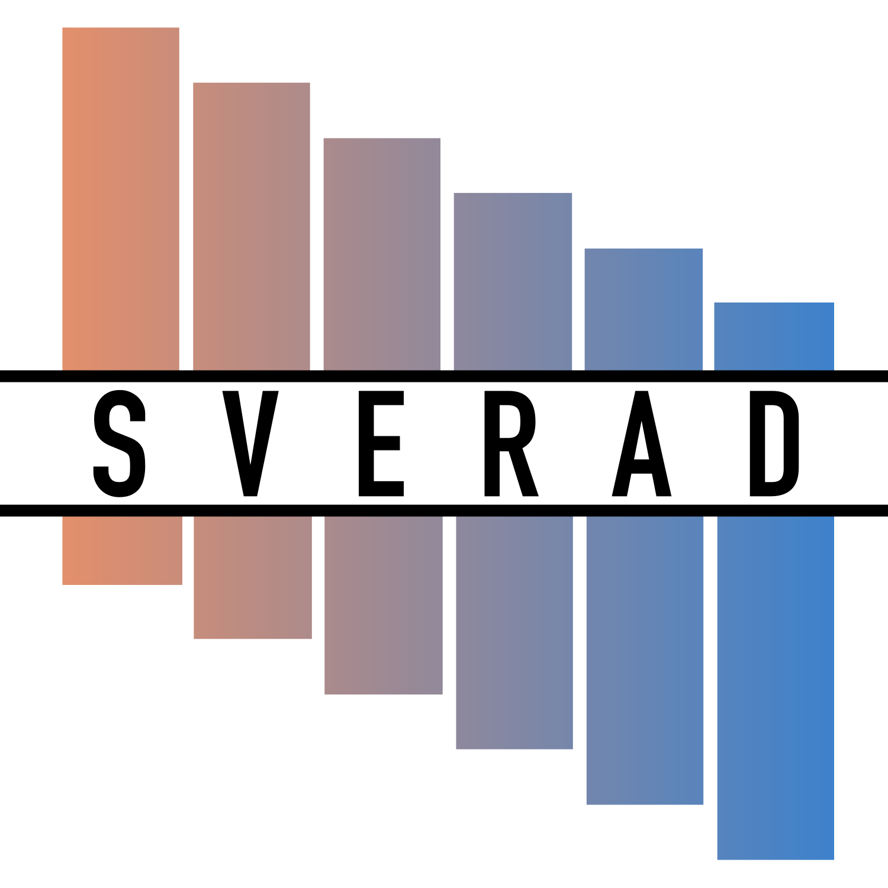
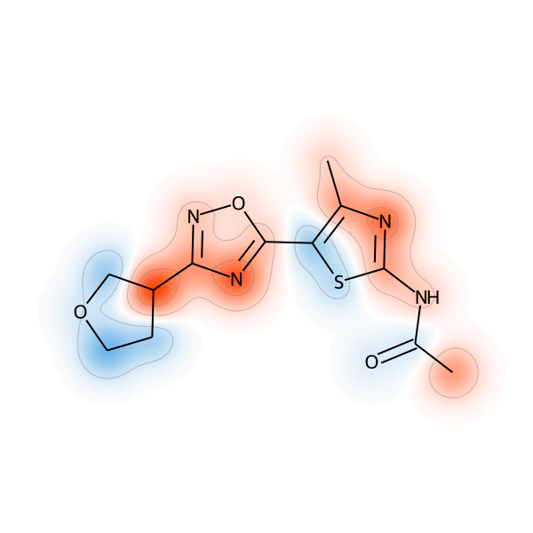

<p align="center">
  
</p>


 [](https://zenodo.org/doi/10.5281/zenodo.10679659)


# SVERAD: Shapley Value-Expressed Radial Basis Function
This is the official repository for the work [**Calculation of exact Shapley values for explaining support vector machine models using the radial basis function kernel**](https://www.nature.com/articles/s41598-023-46930-2).

## Before you start

If you want to use the code, we suggest you create a ```conda``` environmnet with one of the provided environment files (tested on Ubuntu 20.04) and clone the repository.
To install SVERAD, move to the ```src/sverad``` folder and run the command

```bash
pip install .
```

or

```bash
pip install -e .
```
to install in development mode.

## SVERAD facilities

The class ```ExplainingSVC``` contains all the facilities needed to train a Support Vector Classifier and explain its predictions in terms of exact SVERAD Shapley values.

You can import and use SVERAD in you code:

```python
from sverad.sverad_svm import ExplainingSVC as SVERADExplainingSVC

C = 1.0
GAMMA = 1.0
SEED = 42
EMPTY_SET_VALUE = 0.0

sverad_model = SVERADExplainingSVC(C = C, gamma_val = GAMMA, random_state=SEED, empty_set_value=EMPTY_SET_VALUE)

X_train = … #your training data samples
y_train = … #your training data labels
X_test = … #your test data samples

sverad_model.fit(X_train, y_train)

sverad_preds = model.predict(X_test)

sverad_shapley_values = sverad_model.feature_weights(X_test)
```

If you want to indepentently compute SVERAD SV for RBF kernel in your code, use the function ```compute_sverad_sv()``` available in the ```sverad_kernel.py``` module. 

### SVETA
The repository also contains the code from [Calculation of exact Shapley values for support vector machines with Tanimoto kernel enables model interpretation](https://doi.org/10.1016/j.isci.2022.105023). SVETA allows the computation of exact Shapley values for SVM models based on the Tanimoto kernel. You can use SVETA in your code similarly as SVERAD. Install it from the ```src/sveta``` folder and import it as

```python
from sveta.svm import ExplainingSVC as SVETAExplainingSVC
```
then, instatiate the model as

```python
sveta_model = SVETAExplainingSVC(C = C, random_state=SEED, no_player_value=EMPTY_SET_VALUE)
```
## Ready-to-use scripts
We provide ready-to-use scripts to train and explain SVM models using both SVERAD and SVETA and analyze their explanations. ```trainer_explainer_script.py``` performs a grid search to train and optimize SVM models with the RBF and Tanomoto kernels and then explains the prediction using SVERAD and SVETA exact Shapley value computation. ```explanation_analyzer_script.py``` performs an analysis of the explanations, generating boxplots indicating the contributions of features present and absent in test instances. The scripts load parameters from the ```parameters.yml``` file, which can be edited according to needs. Moreover, important features are mapped to correctly predicted test compounds, generating figures such as the one reported below:

<p align="center">
  
</p>

```trainer_explainer_script.py``` and ```explanation_analyzer_script.py``` are the scripts described in the protocol paper.

## Reproducibility

The repo contains the source code and the notebooks usable to reproduce the experiments and results in the Scientific Reports paper. It is possible to use the nooteboks provided to replicate the experiments:

* ```explanations_rbf_random_vectors.ipynb``` replicates the experiments for the computation of exact SV with small randomly geenrated vectors.
* ```rbf_50_compounds_SVERAD_vs_SHAP.ipynb``` compares SVERAD and SHAP for randomly drawn compounds.
* ```calculation_SVs_SVM_RF.ipynb``` is used to both train and optimize the SVM and RF models via Grid Search and to compute exact SV with SVERAD and TreeSHAP and SHAP values with KernelSHAP.
* ```analysis_SVs_SVM_RF.ipynb``` derives analyses and statistics on the computed SV and SHAP values.

## Running times

As a reference measurement for comparison, executing SVERAD on the dataset provided within the repo with a machine mounting an Intel Core i7-12700H with 4.70 GHz of maximum clock speed and 16 GB of RAM took around 22 seconds, analogously to TreeSHAP, while running KernelSHAP calculations took more than 5.5 hours.

### Contacts

For any queries or information, feel free to drop an [email](mailto:mastropietro@diag.uniroma1.it).

## Citations

If you like and use our work, please cite our publication in **Scientific Reports** 😄

Mastropietro, A., Feldmann, C. & Bajorath, J. [Calculation of exact Shapley values for explaining support vector machine models using the radial basis function kernel](https://www.nature.com/articles/s41598-023-46930-2). Sci Rep 13, 19561 (2023). https://doi.org/10.1038/s41598-023-46930-2

Special thanks to [Simone Fiacco](https://www.linkedin.com/in/simone-fiacco-27bb5a25a/) for creating the SVERAD logo.
